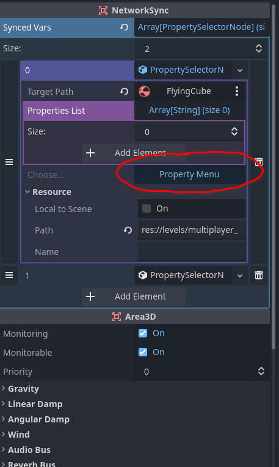

# Property Selector Object

<div align="center>


[](LICENSE)
[](https://godotengine.org/)

A plugin that simplifies property management with an intuitive interface.


## Installation

**Via Asset Library**
1. Open the Godot Asset Library within your project
2. Search for "Property Selection Window"
3. Download and install the plugin

**Via Git**
```bash
git clone git@github.com:PerishoJ/godot-property-selection-window.git
```

**Enable the Plugin**
1. Navigate to `Project → Project Settings → Plugins`
2. Locate `Property Selector`
3. Enable the plugin via the checkbox

## Implementation

### Basic Usage
Export a property with a type of PropertySelection as the hint.
This is a Resource that contains a NodePath to an object and a list
of manually selected properties.

Exporting this object 
```gdscript
@export var property_selector : PropertySelection
```

To select properties from the Inspector, click the blue button labeled "Property Menu"



The Property Selection Window will pop-up, and you can choose which subset of properties you would like.


## Contributing

1. Fork the repository
2. Create a feature branch (`git checkout -b feature/NewFeature`)
3. Commit your changes (`git commit -m 'Add NewFeature'`)
4. Push to the branch (`git push origin feature/NewFeature`)
5. Open a Pull Request

## License

Distributed under the MIT License. See [`LICENSE`](LICENSE) for more information.

## Special Thanks

ImTani, who developed the "property selection window" plugin

This tool is a fork of the original "property selection window" plugin, whose source code can be found here : git@github.com:PerishoJ/godot-property-selection-window.git

---

<div align="center">
Built for the Godot community
</div>
